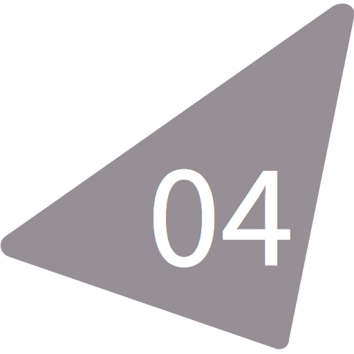

# basscss-radium
 Basscss as Radium-flavoured inline
styles.


## Getting Started
```
npm install --save basscss-radium
```

## Usage
```
const React = require('react');
const Radium = require('radium');
const Bass = require('basscss-radium');

/**
 * Badges are used to represent properties and states and to tease
 * quantities of resources behind navigation links. Use basic utilities
 * and color styles to create badges.
 */
const Badge = ({ text }) => {
  return (
    <span style={[
      Bass.h2,
      Bass.inlineBlock,
      Bass.px1,
      Bass.white,
      Bass.bgRed,
      Bass.rounded,
    ]}>
      { text }
    </span>
  );
};

Badge.displayName = 'Badge';
Badge.propTypes = {
  /**
   * Text displayed in the badge.
   */
  text: React.PropTypes.string,
};

module.exports = Radium(Badge);
```

Pssst...jump into the [playground to see it in action](https://tonicdev.com/bertrand/basscss-radium).

## Credits and License
[Brent Jackson](https://github.com/jxnblk) (jxnblk.com) is the original
creator and maintainer of [Basscss](https://github.com/basscss/basscss).
We encourage you to take a look at
[Rebass](https://github.com/jxnblk/rebass) for an alternative to using
Basscss with React.

This program is free software: you can redistribute it and/or modify it
under the terms of the [MIT
LICENSE](http://opensource.org/licenses/MIT).
